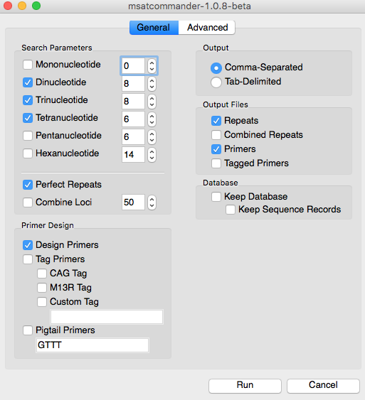
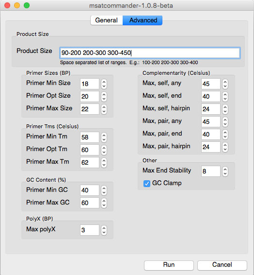

## 1. Assembly

After checking your reads quality and trimming eventual adapters, the first step is to construct an assembly. It does not need to be a great assembly by any mean, just to embeed microsatellites repeats.
If the assembly is only to be  used for microsatellites identification, I usually takes a small amount of reads and construct a fast assembly using [SPAdes](http://cab.spbu.ru/software/spades/) on a subset of reads (i.e. subsampled sing [seqtk]( https://github.com/lh3/seqtk.git))
Using a subset of reads allow for a fast and memory efficient assembly. 

Here is an example of assembly for paired-end reads using SPAdes 3.11

```
#!/bin/sh
mkdir -p assembly10
seqtk sample -s100 FORWARDREADS.fastq.gz 0.1 > forward_10percent.fastq # the s is the seed making sure we take erxactly the same forward and reverse.
seqtk sample -s100 REVERSEREADS.fastq.gz 0.1 > reverse_10percent.fastq
spades.py  -t 8 -m 100 -o assembly10/ -1  forward_10percent.fastq -2 reverse_10percent.fastq # 8 cores and 16G of memory
```

## 2. Detection of microsatellites

For this step we will rely on [MSATCOMMANDER](https://code.google.com/archive/p/msatcommander/downloads). The command line can be run, but the GUI is easy and offer a great overview of the aprameters. Below are sensible settings for microsatellites design. They can of course be adapted to your wishes.




MSATCOMMANDER will first ask you for the fasta genome file and then for an output folder.

## 3. Cleaning MSAT COMMANDER OUTPUT

The output of MsatCommander contains lot of information across a couple of files. We might want to combine this information and proceed to a few cleaning checks:

1. Remove primers that are indicated as duplicated by MSATCOMMANDER
2. Remove Microsatellites sequences that overlap with each other

Step 2 is the center of the pipeline ran by [MSATCOMMANDER](https://code.google.com/archive/p/msatcommander/downloads)

It can be run as follow if you are in the folder with the output of msatcommander:

```
python2.7 clean_msatcomm_output.py yourgenome.fasta
```

Have a look at the help if you have other paths.

```
python2.7 clean_msatcomm_output.py --help
```

